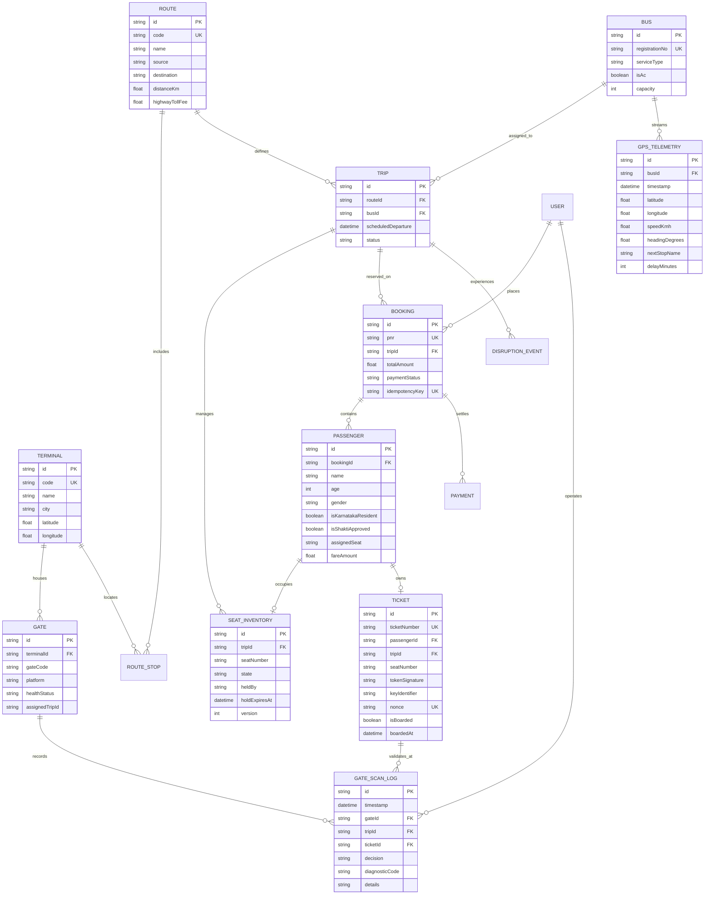

# Karnataka Smart Transit 2.0 — Architecture & Entity-Relationship Specification

## 1. System Overview & Monorepo Structure

```
bus-system/
├── apps/
│   ├── api/                     # Node.js + Express + Socket.IO REST & WebSocket API
│   │   └── src/
│   │       ├── db/              # Relational repository with atomic row-level mutex locks
│   │       └── services/        # GPS fleet telemetry simulator & highway waypoints
│   └── web/                     # Frontend client dashboard (HTML5, Tailwind, Leaflet, Web Audio)
├── packages/
│   └── shared/                  # Domain contracts, Zod schemas, versioned tariffs, cryptographic tokens
│       ├── types.js             # Zod validation schemas for booking, gates, telemetry
│       ├── tariffs.js           # Configurable tariff engine with Shakti Scheme logic
│       └── securityToken.js     # HMAC-SHA256 compact token signing & verification
├── prisma/
│   └── schema.prisma            # Production PostgreSQL relational schema (15 entities)
├── config/
│   └── tariffs.v1.json          # Versioned, configurable tariff rate cards and concession policies
├── scripts/
│   └── seed.js                  # Deterministic database seeding script
├── tests/
│   └── smartTransit2.test.js    # Concurrency races, security tokens, gate access, and GPS tests
├── docs/
│   ├── architecture.md          # Architecture & Database ER diagram
│   └── api_contracts.md         # REST & WebSocket API specifications
├── docker-compose.yml           # PostgreSQL 16 + Redis 7 + Node API container topology
├── .env.example                 # Standardized environment configuration template
└── README.md                    # Platform documentation and user guide
```

---

## 2. Relational Database Entity-Relationship (ER) Diagram



---

## 3. Concurrency & Security Architecture

1. **Atomic Seat Booking & Double-Booking Prevention**:
   - Each trip operates an in-memory or database-level row mutex (`TRIP_LOCK_{tripId}`).
   - When concurrent requests arrive for the same seat, they are serialized.
   - The first request verifies seat state (`AVAILABLE`), transitions state to `CONFIRMED`, and increments optimistic concurrency `version`.
   - The second request discovers state is no longer `AVAILABLE`, aborts atomically, and returns a clean `409 Conflict` error.

2. **Cryptographic Transit Token Format (`KST2`)**:
   - Structure: `KST2.<keyIdentifier>.<base64UrlPayload>.<hmacSignature>`
   - Payload:
     ```json
     {
       "tid": "KA-KSRTC-2026-15956",
       "pnr": "KA591332",
       "bid": "BUS-KA-01-4821",
       "rid": "route-1",
       "sid": "12W",
       "pid": "PAX-9A82BC10",
       "iat": 1727627400,
       "exp": 1727713800,
       "nonce": "7f8b92a10c9d3e4f"
     }
     ```
   - Verified server-side via constant-time cryptographic equality (`crypto.timingSafeEqual`) to eliminate timing side-channel exploits.

3. **Turnstile Digital Twin States**:
   - `LOCKED_IDLE`: Waiting for scan, barrier flaps centered, sensor beams armed.
   - `VERIFYING`: Optical QR decoded, cryptographic hash evaluated against server keystore.
   - `ACCESS_GRANTED`: Flaps swing open 70° outward, green LED pulse, welcome chime synthesized.
   - `ACCESS_DENIED`: Flaps remain locked shut, red LED strobe, rejection buzzer alarm.
   - `SENSOR_OBSTRUCTION`: Anti-tailgating alarm sounds if passage sensor is held without authorization.
   - `EMERGENCY_EGRESS`: Failsafe override swinging both flaps outward for unrestricted terminal evacuation.
